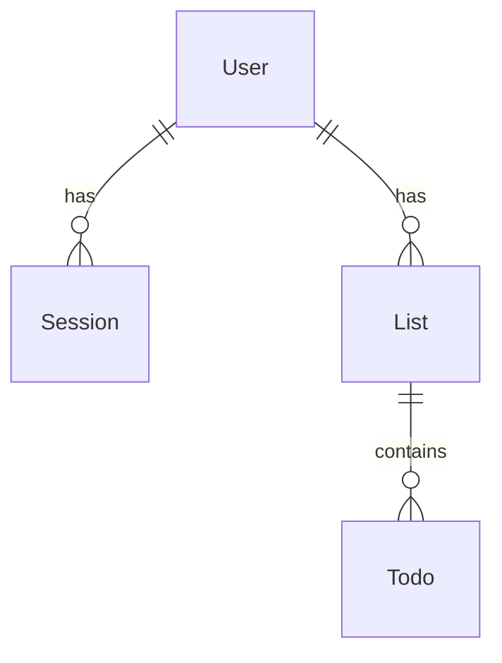
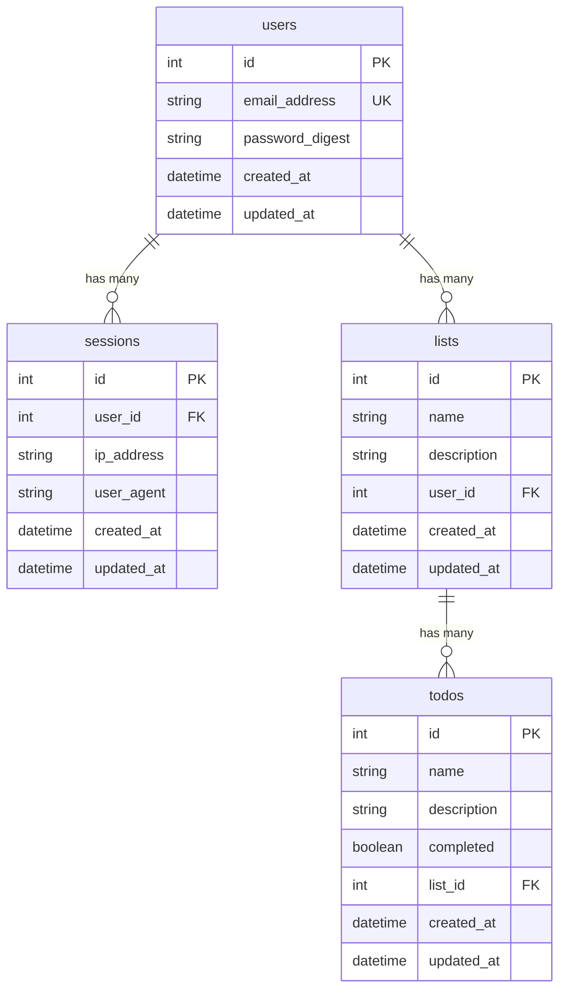
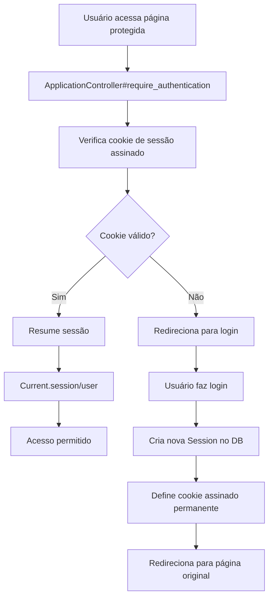

# My Todo List

Uma aplicação moderna de gerenciamento de tarefas desenvolvida com Ruby on Rails 8, apresentando autenticação completa, internacionalização e uma interface elegante com Tailwind CSS.

## Índice

- [Sobre o Projeto](#sobre-o-projeto)
- [Tecnologias Utilizadas](#tecnologias-utilizadas)
- [Arquitetura da Aplicação](#arquitetura-da-aplicação)
- [Funcionalidades](#funcionalidades)
- [Pré-requisitos](#pré-requisitos)
- [Instalação e Configuração](#instalação-e-configuração)
- [Como Executar](#como-executar)
- [Estrutura do Banco de Dados](#estrutura-do-banco-de-dados)
- [Sistema de Autenticação](#sistema-de-autenticação)
- [Controllers e Rotas](#controllers-e-rotas)
- [Internacionalização](#internacionalização)
- [Testes](#testes)
- [Deploy](#deploy)

---

## Sobre o Projeto

**My Todo List** é uma aplicação completa de gerenciamento de tarefas que permite aos usuários organizar suas atividades em listas personalizadas. A aplicação foi desenvolvida seguindo as melhores práticas do Rails 8, com foco em código limpo, segurança e experiência do usuário.

### Principais Destaques

- Sistema completo de autenticação com sessões
- Recuperação de senha por email
- Organização de tarefas em listas
- Acompanhamento de progresso com percentuais de conclusão
- Interface responsiva com Tailwind CSS 4.4
- Internacionalização (Português e Inglês)
- Rate limiting para proteção contra ataques
- Validações robustas em todos os modelos

---

## Tecnologias Utilizadas

### Backend
- **Ruby** 3.x
- **Rails** 8.0.2
- **SQLite3** - Banco de dados
- **BCrypt** - Criptografia de senhas

### Frontend
- **Tailwind CSS** 4.4 - Framework CSS utilitário
- **Hotwire** (Turbo + Stimulus) - Interatividade moderna sem muito JavaScript
- **ImportMap** - Gerenciamento de JavaScript sem bundlers

### Ferramentas de Desenvolvimento
- **Puma** - Servidor web
- **Rubocop** - Análise estática de código
- **Brakeman** - Análise de segurança

---

## Arquitetura da Aplicação

### Modelos de Dados

A aplicação é construída sobre quatro modelos principais:

#### 1. **User** (Usuário)
```ruby
- email_address: string (único, validado)
- password_digest: string (criptografado com BCrypt)
- Associações: has_many :sessions, has_many :lists
```

#### 2. **Session** (Sessão)
```ruby
- user_id: integer (referência ao usuário)
- ip_address: string
- user_agent: string
- Associações: belongs_to :user
```

#### 3. **List** (Lista)
```ruby
- name: string (obrigatório)
- description: string
- user_id: integer (referência ao usuário)
- Associações: belongs_to :user, has_many :todos
```

#### 4. **Todo** (Tarefa)
```ruby
- name: string (obrigatório)
- description: string
- completed: boolean
- list_id: integer (referência à lista)
- Associações: belongs_to :list
```

### Relacionamentos



---

## Funcionalidades

### Autenticação e Autorização
- Cadastro de novos usuários com validação de email
- Login com email e senha
- Logout seguro com destruição de sessão
- Recuperação de senha via email
- Proteção contra força bruta com rate limiting (10 tentativas a cada 3 minutos)
- Sessões persistentes com cookies assinados
- Rastreamento de IP e User Agent

### Gerenciamento de Listas
- Criar listas com nome e descrição
- Editar informações da lista
- Excluir lista (com todas as tarefas associadas)
- Visualizar estatísticas de conclusão
- Interface card-based com indicadores visuais

### Gerenciamento de Tarefas
- Adicionar tarefas a uma lista
- Editar informações da tarefa
- Marcar/desmarcar como concluída com um clique
- Excluir tarefas
- Visualização detalhada de cada tarefa
- Ordenação por data de criação

### Interface do Usuário
- Design responsivo para desktop e mobile
- Feedback visual com mensagens flash
- Confirmação antes de ações destrutivas
- Estados vazios informativos
- Indicadores de progresso
- Transições suaves

---

## Pré-requisitos

Antes de começar, certifique-se de ter instalado:

- **Ruby** 3.x ou superior
- **Rails** 8.0.2 ou superior
- **SQLite3**
- **Node.js** (para gerenciamento de assets)
- **Git**

### Verificando as versões

```bash
ruby -v    # Deve retornar 3.x.x
rails -v   # Deve retornar 8.0.2
sqlite3 --version
node -v
```

---

## Instalação e Configuração

### 1. Clone o Repositório

```bash
git clone https://github.com/yohannemoreira/my-todo-list.git
cd my-todo-list
```

### 2. Instale as Dependências

```bash
bundle install

bin/importmap pin --all
```

### 3. Configure o Banco de Dados

```bash
bin/rails db:create

bin/rails db:migrate

bin/rails db:seed
```

### 4. Configure as Variáveis de Ambiente

A aplicação usa credenciais criptografadas do Rails. Para desenvolvimento local:

```bash
EDITOR="nano" bin/rails credentials:edit
```

---

## Como Executar

### Modo Desenvolvimento

A aplicação usa o **Procfile.dev** para executar múltiplos processos simultaneamente:

```bash
bin/dev
```

Ou execute os processos separadamente:

```bash
bin/rails server

bin/rails tailwindcss:watch
```

### Acessando a Aplicação

Abra seu navegador e acesse:
```
http://localhost:3000
```

### Modo Produção

```bash
bin/rails assets:precompile

RAILS_ENV=production bin/rails server
```

---

## Estrutura do Banco de Dados

### Diagrama ER



### Migrações

As migrações estão localizadas em `db/migrate/`:

- `20251109001608_create_lists.rb` - Cria tabela de listas
- `20251109001739_create_todos.rb` - Cria tabela de tarefas
- `20251109165600_create_users.rb` - Cria tabela de usuários
- `20251109165645_create_sessions.rb` - Cria tabela de sessões

---

## Sistema de Autenticação

A aplicação implementa um sistema de autenticação completo e seguro usando o concern `Authentication`.

### Fluxo de Autenticação



### Componentes de Autenticação

#### 1. **Authentication Concern**
Localizado em `app/controllers/concerns/authentication.rb`

**Responsabilidades:**
- Gerenciar ciclo de vida de sessões
- Proteger rotas com `before_action`
- Criar e destruir sessões de forma segura
- Manter estado do usuário atual

**Principais métodos:**
```ruby
- require_authentication    # Força autenticação
- authenticated?           # Verifica se está autenticado
- start_new_session_for    # Inicia nova sessão
- terminate_session        # Encerra sessão atual
- after_authentication_url # Retorna URL de redirecionamento
```

#### 2. **Current (CurrentAttributes)**
Localizado em `app/models/current.rb`

Thread-safe storage para sessão e usuário atual:
```ruby
Current.session  # Sessão atual
Current.user     # Usuário autenticado
```

#### 3. **SessionsController**
Gerencia login e logout:
- **Rate limiting:** 10 tentativas a cada 3 minutos
- **Validação:** Usa `User.authenticate_by` do Rails 8
- **Segurança:** Registra IP e User Agent

#### 4. **RegistrationsController**
Gerencia cadastro de novos usuários:
- Validação de email único
- Senha mínima de 8 caracteres
- Confirmação de senha
- Auto-login após cadastro

#### 5. **PasswordsController**
Recuperação de senha:
- Envia email com token temporário
- Token assinado com expiração
- Proteção contra timing attacks

### Segurança

- Senhas criptografadas com BCrypt (cost factor 12)
- Cookies assinados (HttpOnly, SameSite: Lax)
- Proteção CSRF nativa do Rails
- Rate limiting em endpoints sensíveis
- Tokens de recuperação com expiração
- Validação rigorosa de emails

---

## Controllers e Rotas

### Rotas Principais

```ruby
# Autenticação
resource :session                    # Login/Logout
resource :registration              # Cadastro
resources :passwords                # Recuperação de senha

# Funcionalidades principais
root "lists#index"                  # Página inicial
post "switch_locale"                # Troca de idioma

# Listas e Tarefas (nested resources)
resources :lists do
  resources :todos do
    member do
      patch :toggle                 # Toggle status da tarefa
    end
  end
end
```

### Controllers

#### **ApplicationController**
Base para todos os controllers com:
- Autenticação obrigatória por padrão
- Configuração de locale (i18n)
- Proteção de navegadores modernos

#### **ListsController**
CRUD completo de listas:
- `index` - Lista todas as listas do usuário
- `show` - Exibe lista com suas tarefas
- `new/create` - Cria nova lista
- `edit/update` - Edita lista existente
- `destroy` - Remove lista e tarefas

**Escopo:** Todas as queries filtradas por `Current.user`

#### **TodosController**
CRUD completo de tarefas:
- `index` - Lista tarefas de uma lista
- `show` - Exibe detalhes da tarefa
- `new/create` - Cria nova tarefa
- `edit/update` - Edita tarefa
- `toggle` - Alterna status completed
- `destroy` - Remove tarefa

**Nested Resource:** Sempre dentro do contexto de uma lista

---

## Internacionalização

A aplicação suporta múltiplos idiomas usando o sistema i18n do Rails.

### Idiomas Disponíveis
- **Português (pt-BR)** - Idioma padrão
- **Inglês (en)**

### Configuração

Em `config/application.rb`:
```ruby
config.i18n.default_locale = "pt-BR"
config.i18n.available_locales = [:en, "pt-BR"]
config.i18n.fallbacks = [I18n.default_locale]
```

### Estrutura de Traduções

Arquivo: `config/locales/pt-BR.yml`

**Organização:**
```yaml
pt-BR:
  app:           # Nome da aplicação
  common:        # Textos comuns (botões, ações)
  lists:         # Traduções de listas
  todos:         # Traduções de tarefas
  auth:          # Autenticação
  registrations: # Cadastro
  activerecord:  # Modelos e validações
```

### Troca de Idioma

Os usuários podem trocar o idioma na interface. O locale é persistido na sessão:

```ruby
# LocalesController
def update
  session[:locale] = params[:locale]
  redirect_back(fallback_location: root_path)
end
```

---

## Testes

### Executando os Testes

```bash
# Todos os testes
bin/rails test

# Testes de models
bin/rails test:models

# Testes de controllers
bin/rails test:controllers

# Testes de sistema (browser)
bin/rails test:system

# Teste específico
bin/rails test test/models/user_test.rb
```

### Cobertura de Testes

A aplicação inclui:
- Testes de modelo (validações, associações)
- Testes de controller (autenticação, CRUD)
- Testes de sistema (fluxos completos)
- Testes de mailers

### Fixtures

Dados de exemplo para testes em `test/fixtures/`:
- `users.yml`
- `lists.yml`
- `todos.yml`
- `sessions.yml`

---

## Deploy

### Docker

A aplicação está pronta para deploy com Docker:

```bash
docker build -t my-todo-list .

docker run -p 3000:3000 my-todo-list
```

### Variáveis de Ambiente (Produção)

```bash
RAILS_ENV=production
SECRET_KEY_BASE=<seu_secret_key>
DATABASE_URL=<url_do_banco>
RAILS_SERVE_STATIC_FILES=true
RAILS_LOG_TO_STDOUT=true
```

---

## Estrutura de Pastas

```
my-todo-list/
├── app/
│   ├── controllers/        # Controllers (MVC)
│   │   ├── concerns/      # Concerns reutilizáveis
│   │   └── *.rb
│   ├── models/            # Models (MVC)
│   │   └── *.rb
│   ├── views/             # Views (MVC)
│   │   ├── layouts/       # Layouts principais
│   │   ├── lists/         # Views de listas
│   │   ├── todos/         # Views de tarefas
│   │   └── sessions/      # Views de autenticação
│   ├── helpers/           # Helper methods
│   ├── javascript/        # JavaScript (Stimulus)
│   ├── assets/            # CSS, imagens
│   └── mailers/           # Email templates
├── config/
│   ├── locales/           # Traduções i18n
│   ├── routes.rb          # Definição de rotas
│   └── application.rb     # Configuração principal
├── db/
│   ├── migrate/           # Migrações do banco
│   └── schema.rb          # Esquema atual
├── test/                  # Testes automatizados
└── public/                # Assets públicos
```

---

## Conceitos Demonstrados

Este projeto demonstra proficiência em:

### Ruby on Rails
- Rails 8 com recursos modernos
- Active Record (models, associations, validations)
- Action Controller (RESTful design)
- Action View (layouts, partials, helpers)
- Action Mailer (emails transacionais)
- Concerns e DRY principles
- I18n (internacionalização)
- Migrações e schema management

### Segurança
- Autenticação do zero (sem Devise)
- BCrypt para senhas
- Proteção CSRF
- Rate limiting
- Cookies seguros
- Tokens com expiração

### Frontend
- Tailwind CSS 4.4
- Hotwire (Turbo + Stimulus)
- Design responsivo
- UX patterns (loading states, confirmations)

### Boas Práticas
- Código limpo e idiomático
- Separação de responsabilidades
- DRY (Don't Repeat Yourself)
- RESTful design
- Convenções sobre configuração
- Testes automatizados

---

## Autor

**Yohanne Moreira**
- GitHub: [@yohannemoreira](https://github.com/yohannemoreira)


